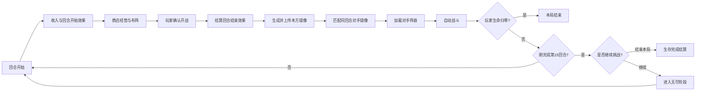
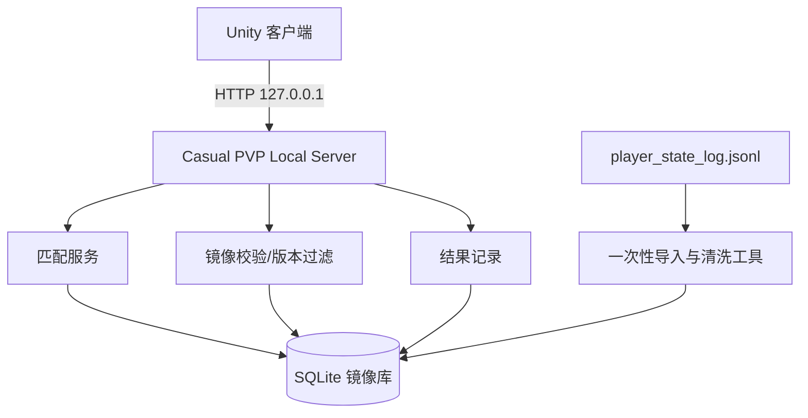

# 休闲对战模式（异步镜像 PVP）系统与玩法设计

> 文档状态：方案草案（已同步 2026-08-26 产品确认项）  
> 创建日期：2026-08-26  
> 适用项目：Prophecy Century  
> 核心定位：类似《背包乱斗》的异步 PVP——玩家每回合迎战另一名玩家在相同回合留下的阵容镜像，不要求双方同时在线。

## 1. 目标与结论

休闲对战模式是一条独立于当前地图/PVE 战役的单局玩法。玩家以 100 点生命开始，在经营阶段组建阵容；每回合锁定阵容后，从服务器随机取得一份“相同回合”的历史玩家镜像，并使用现有自动战斗系统完成战斗。

首版推荐采用“本机虚拟服务器”验证完整链路：

- 玩家客户端仍是 Unity 游戏。
- 本机启动一个仅监听 `127.0.0.1` 的 HTTP 服务。
- 服务端使用 SQLite 保存、索引和随机抽取镜像数据。
- 现有 `player_state_log.jsonl` 作为历史种子数据导入，不直接充当在线数据库。
- 战斗在客户端执行；服务器只负责镜像存取、匹配和结果记录。
- 后续迁移到真正远端服务器时，尽量保持接口和数据结构不变。

已确认的产品规则：

- 第 15 回合是生存里程碑，不是强制终点。
- 完成第 15 回合且生命大于 0 时，询问玩家“结束本局”或“继续挑战”。
- 选择继续后进入无尽阶段，不再重复询问，一直战斗到生命归零。
- 保留英雄选择、英雄能力及当前完整经营系统。
- 失败沿用现有普通战斗扣血公式。
- 使用独立于战役存档的休闲对战存档区域。
- 独立休闲存档区首版提供 3 个槽位，可同时保留 3 局进度。
- 锁定本方阵容前不展示对手；完成匹配后展示对手完整阵容、站位和战力，但不能返回经营调整。

首版的重点不是排行榜或强对抗，而是验证以下体验是否成立：

1. 每回合遇到“像真实玩家养成出来”的阵容。
2. 对手强度随回合自然成长，而不是依赖固定怪物表。
3. 同一局中对手尽量不重复，阵容具有变化感。
4. 即使本地样本不足，也不会卡死对局。

## 2. 模式边界

### 2.1 MVP 包含

- 主菜单新增“休闲对战”入口。
- 新局固定初始生命 100。
- 复用当前商店、购买、合成、布阵和单位技能系统。
- 每回合结束经营后自动匹配同回合对手镜像。
- 复用当前自动战斗演出和伤害结算。
- 胜利进入下一回合；失败扣除生命，生命归零则结束。
- 每场战斗前将本方阵容保存为可供未来匹配的镜像。
- 本机服务器提供数据导入、镜像池统计、匹配和结果记录能力。

### 2.2 MVP 不包含

- 实时联机、房间、邀请或断线重连。
- 两名玩家之间同步战斗结果。
- 天梯、赛季、段位、奖励结算。
- 服务端权威战斗和完整反作弊。
- 跨版本强制兼容旧阵容。
- 好友指定挑战。

“异步镜像”意味着玩家对战的是一份不可变阵容快照，而非操控中的真人。双方不需要同时在线；A 击败 B 的镜像也不会扣除 B 当前存档的生命。

## 3. 核心玩法规则

### 3.1 单局初始状态

| 项目 | MVP 规则 |
| --- | --- |
| 初始生命 | 100 |
| 初始金币 | 复用当前全局配置，当前默认值为 3 |
| 初始商店等级 | 1 |
| 初始回合 | 1 |
| 地图系统 | 不进入世界地图 |
| 敌人来源 | 同回合玩家镜像池 |
| 战斗操作 | 自动战斗，复用现有战斗系统 |
| 生存里程碑 | 第 15 回合 |
| 继续挑战 | 第 15 回合结算后可选择进入无尽阶段 |
| 失败条件 | 生命降至 0 |
| 完成条件 | 第 15 回合后主动结束，或继续挑战直至生命归零 |

第 15 回合是一次性里程碑。玩家完成该回合且生命大于 0 时，系统询问是否继续：选择“结束本局”会以成功存活完成结算；选择“继续挑战”会进入无尽阶段，此后不再出现相同询问，直到生命降至 0。无尽阶段仍严格匹配相同回合镜像，数据不足时使用该回合系统保底。

### 3.2 每回合流程



关键时序：镜像必须在“回合结束效果已经结算、战斗尚未开始”时生成。这样保存的阵容和本场实际参战阵容一致。

### 3.3 胜负与生命

- 胜利：不扣生命，正常进入下一回合。
- 失败：复用当前普通战斗生命伤害公式，当前单场伤害上限为 20。
- 平局：沿用战斗引擎当前规则，以存活单位数和剩余总生命判定胜负，MVP 不新增第三种结果。
- 生命归零：本局立即结束。
- 完成第 15 回合且仍存活：弹出一次继续挑战询问。
- 选择结束：以“生存完成”结算，并展示回合数、剩余生命、胜负场和最终阵容。
- 选择继续：进入无尽阶段，一直战斗至生命归零；最终成绩以到达回合、胜场和最高战力等指标记录。

建议先复用现有伤害公式，避免“匹配系统、战斗规则和生命规则”同时变化导致无法定位平衡问题。收集足够数据后，再评估是否改为按存活单位星级或战力差扣血。

### 3.4 对手展示

匹配成功后建议展示：

- 对手昵称：本机数据可显示“训练镜像 #编号”。
- 对手数据来源：`本地镜像`、`历史玩家` 或 `系统保底`。
- 对手对应回合。
- 阵容和站位。
- 可选显示总战力，但不显示精确胜率。

不要把异步镜像描述为“对方正在与你战斗”，避免玩家误解为实时 PVP。

## 4. 匹配规则

### 4.1 硬性条件

候选镜像必须同时满足：

1. `round == 当前回合`，不使用相邻回合冒充。
2. 阵容非空，所有必填字段有效。
3. `contentVersion` 与当前客户端兼容。
4. `combatVersion` 与当前战斗规则兼容。
5. 所有 `unitId` 在当前单位表中存在。
6. 站位合法、单位数不超过棋盘上限、数值处于安全范围。
7. 排除本局刚上传的镜像，避免匹配到自己。

### 4.2 随机策略

MVP 使用“过滤后均匀随机”，并增加两个体验约束：

- 最近 5 场遇到过的 `snapshotId` 降低权重或直接排除。
- 同一来源运行 `sourceRunId` 在一局内最多出现 2 次，减少连续遇到同一套成长路线。

暂时不要以战力作为硬匹配条件。严格按战力匹配会让玩家的成长感变弱，并且当前样本量不足。服务端可以记录 `powerScore`，待样本充足后再引入宽松区间，例如优先从玩家战力的 `0.7～1.3` 倍中抽取。

### 4.3 无同回合数据时的降级

“同回合”是模式承诺，因此不建议直接抽取上一回合或下一回合数据。降级顺序如下：

1. 使用该回合已经验证过的玩家镜像。
2. 允许重复抽取本局较早遇到过的同回合镜像。
3. 使用标记为 `system_fallback` 的该回合系统阵容。
4. 若仍不存在，则由现有动态敌人生成器按当前回合生成阵容，并立即转存为该回合的系统镜像。

界面应明确标记“系统保底”，但战斗流程不应中断。服务器不可用时也走第 4 步，并把本局新镜像加入待上传队列。

## 5. 镜像数据定义

### 5.1 设计原则

- 镜像是战斗输入，不是完整玩家存档。
- 不保存姓名、账号、硬件信息等不必要的隐私数据。
- 一旦进入匹配池，镜像内容不可变；修复数据时生成新版本。
- 快照同时带有内容版本和战斗版本，版本不兼容时不得参与匹配。
- 服务端不信任客户端提交的派生战力，导入时需要重新校验或计算。

### 5.2 推荐结构

```json
{
  "schemaVersion": 1,
  "snapshotId": "snap_01J...",
  "sourceRunId": "run_01J...",
  "anonymousPlayerId": "local_seed_001",
  "round": 5,
  "capturedAtUtc": "2026-08-26T08:00:00Z",
  "sourceType": "player",
  "contentVersion": "units_2026_08_26",
  "combatVersion": "battle_v1",
  "powerScore": 1260,
  "units": [
    {
      "unitId": "elf",
      "slotId": "2-1",
      "star": 1,
      "isGolden": false,
      "count": 27,
      "maxHp": 108,
      "attack": 6,
      "defense": 4,
      "power": 1,
      "speed": 6,
      "luck": 0,
      "morale": 0
    }
  ]
}
```

推荐保存“身份字段 + 已结算战斗属性”的混合快照：

- `unitId / slotId / star / isGolden / count` 用于重建单位、技能和表现。
- 已结算属性用于准确还原永久成长、商店强化和回合效果。
- 技能定义仍由当前 `unitId + combatVersion` 对应的客户端配置提供。

如果只保存 `unitId + count`，永久属性成长会丢失；如果只保存最终数值，则可能无法正确恢复技能、种族和表现资源。因此不建议只选其中一种。

### 5.3 与现有结构的关系

项目已有两套可复用结构：

- `CustomChallengeRoundState / CustomChallengeUnitState`：已经支持按回合保存阵容，并能在战斗系统中构建敌方单位。
- `BattleUnitSnapshot`：包含较完整的战斗属性，现有战斗结果日志也会写入部分字段。

建议新增独立的 `CasualPvpSnapshot` DTO，不直接扩展存档模型。它可以通过适配器转换为战斗系统所需的敌方运行时单位。这样不会把网络字段、审核状态等内容混入 `RunState`。

## 6. 本机虚拟服务器设计

### 6.1 架构



推荐目录（进入实现阶段后创建）：

```text
tools/casual-pvp-server/
  server.*
  importer.*
  data/casual_pvp.db
  README.md
```

数据库运行文件不应提交到 Git；仓库中只提交服务端代码、建表脚本和少量脱敏测试种子。

### 6.2 最小接口

| 方法 | 路径 | 用途 |
| --- | --- | --- |
| `GET` | `/health` | 客户端检查本机服务是否可用 |
| `GET` | `/api/v1/pool/stats` | 查看各回合有效镜像数量 |
| `POST` | `/api/v1/snapshots` | 上传本回合玩家镜像 |
| `POST` | `/api/v1/matches` | 按回合请求一个随机对手 |
| `POST` | `/api/v1/matches/{matchId}/result` | 上报战斗结果和诊断数据 |

匹配请求示例：

```json
{
  "round": 5,
  "requesterRunId": "run_01J...",
  "excludeSnapshotIds": ["snap_a", "snap_b"],
  "contentVersion": "units_2026_08_26",
  "combatVersion": "battle_v1"
}
```

匹配响应必须包含 `matchId`、镜像、来源类型和降级原因。客户端应把本场实际使用的 `snapshotId` 写入存档，保证读档后不会无故更换对手。

### 6.3 SQLite 最小表

- `snapshots`：镜像元数据、回合、版本、来源、状态、阵容 JSON、去重哈希。
- `matches`：请求方、选中的镜像、回合、时间、是否降级。
- `battle_results`：胜负、生命变化、双方战力、战斗版本、异常标记。
- `import_jobs`：来源文件、导入数量、拒绝数量和错误摘要。

常用索引：

- `(round, content_version, combat_version, status)`
- `source_run_id`
- `dedupe_hash UNIQUE`

### 6.4 安全边界

- 默认仅绑定 `127.0.0.1`，不开放局域网和公网端口。
- 设置请求体大小、单位数量和数值范围限制。
- 服务端生成 `snapshotId` 和 `matchId`，不直接信任客户端 ID。
- 日志中不记录 Windows 用户名和绝对存档路径。
- 未来开放局域网或公网前，必须增加身份认证、TLS、限流和服务端权威校验。

## 7. Unity 侧集成建议

### 7.1 模式状态

建议不要只依赖 `campaignId` 字符串判断模式，新增显式模式字段，例如：

```text
GameMode.Campaign
GameMode.CustomChallenge
GameMode.CasualAsyncPvp
```

休闲对战的运行状态至少增加：

- `mode`
- `runId`
- `survivalMilestoneRound`（当前为 15）
- `endlessContinuationChosen`
- `currentOpponentSnapshotId`
- `currentMatchId`
- `recentOpponentSnapshotIds`
- `pendingSnapshotUploads`
- `serverEndpoint`

这些字段应进入独立的休闲对战存档区域，确保退出后可继续当前局，并且不会占用或覆盖战役存档。

### 7.2 服务抽象

客户端建议依赖接口而非直接写死 HTTP：

```text
IAsyncOpponentService
  GetPoolStats()
  UploadSnapshot(snapshot)
  FindMatch(request)
  SubmitResult(result)
```

至少提供两个实现：

- `HttpAsyncOpponentService`：连接本机或未来远端服务器。
- `OfflineFallbackOpponentService`：服务器不可用时从本地保底池生成同回合对手。

这样战斗流程不需要了解服务器部署位置。

### 7.3 现有代码复用点

| 当前能力 | 复用方式 |
| --- | --- |
| `ProphecyGameSession.StartNewRun()` | 抽出可按模式配置的初始状态，休闲模式固定 100 HP |
| `RunFlowController` | 新增休闲模式的“经营 → 匹配 → 战斗 → 下一回合”分支 |
| `BattleStubSystem` | 接受指定敌方镜像，而不是内部自行选择预设/动态敌人 |
| `BattleUnitSnapshot` | 作为镜像 DTO 的映射目标之一 |
| `CustomChallengeSystem` | 复用按回合阵容捕获和敌方构建思路，不与其存储耦合 |
| `SaveGameSystem / SaveSlotService` | 保存当前匹配、最近对手和待上传队列 |
| `RunSceneController` | 复用战斗舞台、回放和结算 UI |

战斗系统最好新增显式入口，例如 `Resolve(runState, enemySnapshot)` 和 `CreatePreview(runState, enemySnapshot)`。不要通过临时修改 `campaignId` 或全局变量把镜像伪装成自定义挑战，否则预览与正式结算容易取到不同对手。

## 8. 现有本地数据评估（2026-08-26）

当前数据文件：

```text
Application.persistentDataPath/player_state_log.jsonl
```

本机检查结果：

- 总行数：1356。
- 可被标准 JSON 解析：200。
- 无法解析：1156。
- 可解析的 `battle` 记录：70，其中 `logVersion = 2` 的记录为 68。
- 带非空 `playerUnits`、可直接作为候选种子的战斗记录约 67 条。

有效战斗镜像的回合覆盖：

| 回合 | 可解析战斗记录 | 带玩家阵容 |
| ---: | ---: | ---: |
| 1 | 35 | 34 |
| 2 | 13 | 13 |
| 3 | 8 | 8 |
| 4 | 5 | 5 |
| 5 | 3 | 3 |
| 7 | 1 | 1 |
| 8 | 1 | 1 |
| 9 | 2 | 2 |
| 15 | 1 | 0 |
| 20 | 1 | 0 |

当前数据足以验证前 1～5 回合匹配链路，但不足以稳定支撑第 15 回合里程碑，更不足以覆盖无尽阶段。第 6、10～14 回合需要优先补录；第 16 回合以后必须持续补充玩家镜像或按回合生成系统保底。

大量旧行不可解析的主要原因是早期日志通过字符串拼接 JSON，部分乱码后的单位名称破坏了引号。现有写入逻辑还使用空 `catch`，失败不会给出诊断。导入时应：

1. 逐行解析，不因单条坏数据终止任务。
2. 记录拒绝原因和行号。
3. 优先使用 `unitId`，不依赖可能乱码的 `name`。
4. 对重复阵容计算哈希并去重。
5. 将有效数据转换成新的规范化 schema 后再入库。
6. 后续日志改用正式 JSON 序列化，UTF-8 写入，并记录错误。

现有 v2 战斗日志仅保存了部分战斗属性，缺少 `isGolden`、`luck`、`morale` 以及部分永久成长来源。因此这些数据适合做 MVP 种子，不应被视为百分之百精确的历史复现。

## 9. 异常与恢复

| 场景 | 处理 |
| --- | --- |
| 本机服务器未启动 | 提示“已切换离线保底匹配”，继续游戏 |
| 请求超时 | 1 次快速重试，之后使用本地同回合保底 |
| 返回镜像非法 | 拒绝该镜像并重新请求；记录原因 |
| 当前回合池为空 | 使用同回合系统保底，不跨回合 |
| 上传失败 | 放入存档中的待上传队列，稍后重试 |
| 战斗中退出 | 存档保留 `matchId + snapshotId`，读档继续使用同一镜像 |
| 版本更新 | 旧版本镜像停止参与默认池，必要时离线迁移 |
| 重复点击开始战斗 | 客户端锁定请求；服务端以请求幂等键返回同一场匹配 |

## 10. 数据与平衡指标

MVP 至少记录：

- 各回合镜像池数量、有效率和重复率。
- 各回合匹配等待时间及保底触发率。
- 各回合玩家胜率、平均扣血和剩余生命。
- 双方战力比与实际胜负。
- 单位、阵容、站位的出现率与胜率。
- 同一镜像被匹配次数及对手胜率。
- 客户端与服务器版本不兼容数量。
- 战斗异常、安全轮次上限触发次数。

初步健康目标：

- 第 1～10 回合每回合至少 20 个有效镜像。
- 单局系统保底触发率低于 10%。
- 单一镜像占某回合匹配量不超过 5%。
- 各回合胜率尽量位于 40%～60%，但休闲模式不强制追求 50%。

## 11. 实施阶段

### 阶段 A：数据整理与离线验证

1. 定义 `CasualPvpSnapshot` schema 和版本字段。
2. 编写 JSONL 导入器，输出有效、重复、拒绝统计。
3. 将有效历史数据写入 SQLite。
4. 为缺失回合准备系统保底镜像。
5. 编写“指定回合随机抽取”自动测试。

完成标准：无需启动游戏，也能查询每回合池数量并随机返回合法镜像。

### 阶段 B：本机服务器 MVP

1. 实现 `/health`、镜像上传、匹配和结果上报接口。
2. 服务仅监听 `127.0.0.1`。
3. Unity 新增 `IAsyncOpponentService` 和 HTTP 实现。
4. 战斗系统支持传入固定敌方镜像。
5. 预览和正式结算必须使用同一个 `snapshotId`。

完成标准：Unity 可连续完成至少 10 回合，且每场都能追溯匹配到的镜像。

### 阶段 C：完整玩法与容错

1. 新增休闲对战入口、说明、匹配提示和结算页。
2. 保存/读档恢复当前对手和上传队列。
3. 加入离线保底与服务器超时处理。
4. 接入 100 HP、第 15 回合继续询问和无尽阶段结算。
5. 完成数值与重复匹配统计。

### 阶段 D：远端化准备

1. 将本机地址改为可配置 endpoint。
2. 增加匿名身份、认证、限流和服务端校验。
3. 评估服务端权威模拟或结果复算。
4. 增加赛季池、区域和版本池管理。

## 12. MVP 验收清单

- [ ] 休闲对战新局始终以 100 生命开始。
- [ ] 每回合只匹配 `round` 完全相同的镜像。
- [ ] 不会匹配本局刚上传的自身镜像。
- [ ] 预览、战斗和结算使用同一份对手数据。
- [ ] 镜像站位、单位、星级、数量和关键成长属性正确还原。
- [ ] 胜利不扣血，失败按既有公式扣血，0 血结束。
- [ ] 本机服务器关闭时仍可通过保底阵容继续。
- [ ] 读档不会刷新当前已经锁定的对手。
- [ ] 坏数据、未知单位和版本不兼容镜像不会进入匹配池。
- [ ] 可查看每回合池数量、匹配记录和导入拒绝原因。
- [ ] 第 15 回合只询问一次是否继续，选择结束可正常结算。
- [ ] 选择继续后可进入第 16 回合及以后，并一直运行到生命归零。
- [ ] 无尽阶段不会因空池出现卡死、重复结算或重复上传。

## 13. 实现前需要最终确认的产品项

以下项目仍需在正式实现前定案：

1. 休闲模式是否有局外奖励；MVP 建议没有。
2. 玩家在第 15 回合主动结束时，结果称为“通关”“生存完成”还是“见好就收”。
3. 未来远端服是否允许不同内容版本互相匹配；建议默认不允许。

## 14. 推荐的 MVP 产品定案

为了尽快验证玩法，推荐首版直接采用以下组合：

- 独立模式，无世界地图，使用包含 3 个槽位的独立存档区域。
- 100 初始生命，第 15 回合出现一次继续挑战选择。
- 选择继续后进入无尽阶段，直到生命归零。
- 保留英雄选择与能力，并完整复用当前经营、单位和战斗规则。
- 点击开战后先锁阵容，再上传和匹配；看到对手后不能返回经营。
- 匹配成功后展示对手完整阵容、站位和战力。
- 严格匹配同回合，空池使用同回合系统保底。
- 失败沿用当前普通战斗扣血公式。
- 本机 HTTP + SQLite，客户端战斗权威。
- 暂无奖励、排名和反作弊，只做数据与体验验证。

这套方案对现有工程侵入较小，并且已经有 `CustomChallengeRoundState`、`BattleUnitSnapshot`、`BattleStubSystem` 和回合战斗日志作为基础。真正需要优先解决的是规范化镜像 schema、固定对手注入入口、日志清洗，以及匹配失败时的稳定降级。
