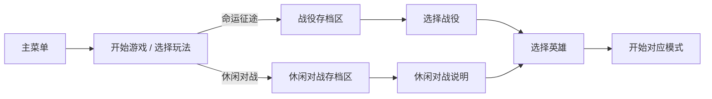
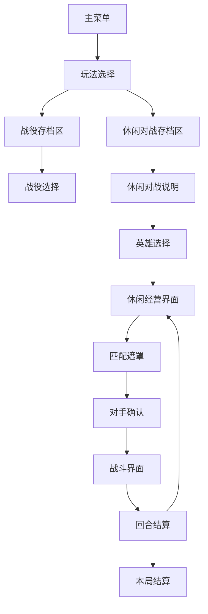

# 休闲对战模式入口、界面与基本流程设计

> 文档状态：UI/UX 方案草案  
> 创建日期：2026-08-26  
> 关联文档：`CASUAL_ASYNC_PVP_MODE_DESIGN.md`  
> 当前设计基线：独立模式、100 初始生命、第 15 回合可选择结束或进入无尽挑战、同回合异步镜像、本机服务器不可用时自动使用同回合保底。

## 1. 设计目标

休闲对战模式应让玩家在进入游戏前明确理解三件事：

1. 对手来自其他玩家留下的历史阵容镜像，并非实时真人。
2. 每回合只会匹配相同回合的数据。
3. 玩家从 100 生命开始，在持续经营和战斗中尽量存活到最终回合。

UI 改造应尽量复用现有主菜单、存档槽、英雄选择、经营、战斗和结算界面，避免为了一个新模式复制整套 UI。

## 2. 推荐入口方案

### 2.1 主流程



推荐在主菜单“开始游戏”之后增加独立的 `GameModeSelectionScreen`。玩家选择模式后，再进入该模式自己的存档区域。

原因：

- 战役和休闲对战使用独立存档区域，必须先选择模式才能展示正确的存档。
- “玩法选择”作为独立页面，可以放置足够的规则说明和未来模式入口。
- 主菜单继续保持简洁，视觉焦点仍是星盘和主操作。
- 以后增加无尽、生存、每日挑战时，不必再次调整主菜单结构。

### 2.2 主菜单调整

现有按钮保持：

```text
继续游戏
开始游戏
设置
制作组
退出游戏
```

只建议在“开始游戏”按钮下增加一行弱提示：

```text
选择战役或休闲对战
```

当休闲对战首次上线时，可以在按钮右上方显示一次性 `新模式` 徽标，但不新增第二个同级主按钮。

### 2.3 独立休闲存档区域

选择休闲对战后进入独立的 `CasualPvpSaveSlotScreen`。首版固定提供 3 个槽位，可同时保留 3 局进度；它不读取、不占用也不覆盖战役存档槽。选择空槽后进入休闲对战说明和英雄选择。

已有存档卡需要增加模式标签：

```text
[休闲对战 · 无尽阶段]
第 18 回合
生命 63 · 5胜2负
最后保存 2026-08-26 21:30
```

第 15 回合之前显示 `第 8 / 15 回合`，选择继续后改为 `第 18 回合 · 无尽阶段`。主菜单“继续游戏”默认恢复所有模式中最后保存的一局，并在按钮副文案中标明模式；玩家也可以从玩法选择页进入各自的存档区域。

## 3. 全局页面结构



## 4. 页面设计

### 4.1 玩法选择页

页面名称建议：`GameModeSelectionScreen`

标题：

```text
选择预言的方式
```

副标题：

```text
踏入既定征途，或与其他预言者留下的镜像交锋
```

布局建议：左右两张大型模式卡。

```text
┌──────────────────────────────────────────────────────────────┐
│ 返回                 选择预言的方式                           │
│                                                              │
│  ┌──────────────────────┐   ┌──────────────────────┐          │
│  │     命运征途          │   │     休闲对战          │          │
│  │                      │   │   ASYNC MIRROR       │          │
│  │ 探索地图、挑战敌人     │   │ 每回合匹配同回合镜像   │          │
│  │ 完成一段完整战役       │   │ 100生命 · 15回合里程碑 │          │
│  │                      │   │                      │          │
│  │    [选择战役]         │   │    [进入模式]         │          │
│  └──────────────────────┘   └──────────────────────┘          │
│                                                              │
│             两种玩法使用相互独立的存档区域                     │
└──────────────────────────────────────────────────────────────┘
```

休闲对战卡必须包含：

- `异步镜像对战` 标签。
- `100 初始生命`。
- `同回合匹配`。
- `无需双方同时在线`。
- 当前服务状态的小图标，但不在这里展示复杂技术信息。

视觉上沿用标题星盘的深蓝黑、金色和冷青色。休闲对战卡可使用两组相对的星阵/棋盘轮廓，表达“镜像”，不要使用传统实时竞技的红蓝 VS 风格。

### 4.2 休闲对战说明页

页面名称建议：`CasualPvpIntroScreen`

这个页面负责规则确认和环境检查，不直接开始匹配。

```text
┌──────────────────────────────────────────────────────────────┐
│ 返回                   休闲对战                               │
│                                                              │
│  [玩法说明]                         [镜像池状态]               │
│  初始生命：100                      ● 本地服务器已连接          │
│  生存里程碑：15回合                  可用镜像：67                │
│  对手：相同回合玩家镜像              回合覆盖：1–5、7–9          │
│  失败：沿用现有公式扣血               缺失回合：系统保底           │
│                                                              │
│  第15回合后可结束本局，或进入无尽挑战直到生命归零。             │
│  对手是历史阵容镜像，不是真人实时操作。                        │
│  每次确认开战后阵容将被锁定，看到对手后不能返回经营。           │
│                                                              │
│                         [选择英雄并开始]                       │
└──────────────────────────────────────────────────────────────┘
```

状态显示规则：

| 状态 | 文案 | 行为 |
| --- | --- | --- |
| 已连接 | `本地镜像库已连接` | 正常进入 |
| 正在检查 | `正在检查镜像库…` | 短暂显示，按钮可等待 1～2 秒 |
| 未连接 | `未连接服务器，将使用离线保底` | 允许进入，不阻塞 |
| 数据不足 | `部分回合将使用系统保底` | 允许进入 |
| 版本不兼容 | `镜像版本不兼容，将使用系统保底` | 允许进入并记录日志 |

开发版本可以显示镜像数量和回合覆盖；正式玩家版本只保留简化状态，避免暴露技术细节。

### 4.3 英雄选择页

战役与休闲对战共用重新设计后的 `HeroSelectionScreen`。页面采用三列对比卡，使玩家在选择前能直接比较英雄的触发条件、收益和适合的经营方向。

每张英雄卡从上到下展示：

1. 玩法定位标签，例如“稳定成长”“出售运营”“经济循环”。
2. 英雄头像、姓名、称号和一句定位描述。
3. 完整被动能力说明。
4. 独立的“触发”与“收益”信息行。
5. 构筑建议和明确的英雄选择按钮。

三名英雄使用不同强调色：詹姆士为暖金、马吉克为奥术紫、夏拉美为经济青绿。页面顶部明确提示“英雄能力贯穿整局，选择后不可更换”。休闲模式保留完整英雄能力，不创建简化版能力。

英雄选择页所有可见文字的最小字号统一为 26。标题和英雄姓名可以使用更大字号；开启自适应缩放的技能说明、构筑建议与按钮文字，其 `resizeTextMinSize` 也不得低于 26。

马吉克的“离阵”严格指向出售行为：只有出售已经上阵的单位才触发随机增援；合成消耗、阵容转换或其他系统移除不触发。

### 4.4 休闲经营主界面

复用现有 `RunPanel`，不创建第二套经营界面。

顶部信息条建议调整为：

```text
[休闲对战]  回合 5/15  生命 76/100  金币 7  商店等级 3  战绩 3胜1负  ●镜像库
```

主要变化：

- 隐藏世界地图相关状态和按钮。
- 原“探索”按钮替换为主要按钮 `锁定阵容并匹配`。
- 保留商店刷新、升级、锁定、保存等现有操作。
- 右侧或日志区域增加“本回合对战”信息卡。

未锁定时的信息卡：

```text
本回合对战
将匹配第 5 回合的玩家镜像
当前阵容战力：1,240
阵容确认后将无法返回经营
```

主按钮状态：

| 状态 | 按钮文案 | 是否可点击 |
| --- | --- | --- |
| 正常经营 | `锁定阵容并匹配` | 是 |
| 有未完成的目标选择 | `请先完成单位选择` | 否 |
| 阵容为空 | `至少上阵 1 个单位` | 否 |
| 正在匹配 | `正在寻找镜像…` | 否 |
| 对手已锁定 | `进入战斗` | 根据演出流程决定 |

点击后弹出轻量确认框：

```text
确认结束本回合经营？
阵容将被保存为镜像，并开始匹配第 5 回合的对手。

[继续经营]  [锁定并匹配]
```

确认框可以在设置中提供“本局不再提示”，但第一局必须出现。

### 4.5 匹配遮罩

页面名称建议：`CasualMatchmakingOverlay`

这是覆盖经营界面的半透明遮罩，而非单独切换场景。背景中的棋盘逐渐暗化，让玩家明确阵容已经锁定。

匹配步骤依次显示：

```text
✓ 已锁定本方阵容
✓ 已保存第 5 回合镜像
● 正在寻找第 5 回合对手……
```

匹配成功：

```text
已找到对手
训练镜像 #024
第 5 回合 · 玩家镜像
```

服务器不可用或池为空：

```text
正在启用同回合保底阵容……
```

建议总等待时间不超过 3 秒。本机匹配即使瞬间完成，也保留约 0.8～1.2 秒的最短演出，使“匹配到对手”具有仪式感。不要为了模拟联网强制等待数秒。

交互规则：

- 上传尚未完成时可以取消，返回经营并解除阵容锁定。
- 对手已经返回后不能取消，防止通过反复匹配挑选阵容。
- 请求超时后自动走保底，不要求玩家手动重试。

### 4.6 对手揭示页

页面名称建议：`CasualOpponentRevealPanel`

匹配后先展示约 1.5～2 秒的对手揭示，再进入现有战斗舞台。

```text
┌──────────────────────────────────────────────────────────────┐
│                     第 5 回合                                │
│                                                              │
│      我方阵容              VS              对手镜像           │
│      战力 1,240                            战力 1,315          │
│      生命 76                               训练镜像 #024       │
│                                            历史玩家数据        │
│                                                              │
│               [查看阵容]          [进入战斗]                  │
└──────────────────────────────────────────────────────────────┘
```

已确认：锁定本方阵容前不显示任何对手阵容信息。匹配完成后展示对手完整单位、站位和战力；此时本方阵容已经锁定，不能返回经营调整，也不能取消后重新抽取。

可在设置中提供“自动跳过对手揭示”。默认 2 秒后自动进入战斗，玩家点击“进入战斗”可立即跳过等待。

### 4.7 战斗界面

复用当前 `BattleStagePanel` 和战斗回放。

新增的最小信息：

- 顶部：`休闲对战 · 第 5 回合`。
- 敌方名称：`训练镜像 #024`。
- 来源徽标：`玩家镜像` 或 `系统保底`。
- 战斗日志记录 `matchId` 和 `snapshotId`，但普通玩家界面不显示技术 ID。

不要在战斗过程中重新请求服务器。战斗开始前应已完整取得镜像，即使服务器此时关闭，战斗仍能完成。

### 4.8 回合结算页

战斗结束后显示一张覆盖式结算卡：

胜利示例：

```text
本回合胜利
生命 76 → 76
战绩 4胜1负

我方剩余 3 个单位
对手：训练镜像 #024

[查看战斗记录]  [进入第 6 回合]
```

失败示例：

```text
本回合失败
生命 76 → 68    -8
战绩 3胜2负

对方剩余 2 个单位
对手：训练镜像 #024

[查看战斗记录]  [继续经营]
```

生命变化应是结算页第一视觉重点。建议不自动跳过，让玩家主动确认进入下一回合。

点击下一回合后才执行：

1. 回合数加一。
2. 应用回合开始资源与效果。
3. 刷新商店。
4. 清除当前对手锁定。
5. 保存新回合状态。

### 4.9 第 15 回合里程碑

第 15 回合结束且生命大于 0 时，显示一次性选择页：

```text
你已度过十五轮交锋

当前生命 42 / 100
战绩 9胜6负
你可以带着当前成绩结束本局，
或继续挑战，直到生命归零。

[结束本局]  [继续挑战]
```

- `结束本局`：进入“生存完成”结算，不按失败处理。
- `继续挑战`：写入存档标记，进入第 16 回合和无尽阶段。
- 该询问每局只出现一次；无尽阶段此后一直战斗到生命归零。
- 选择继续前使用二次确认文案：`进入无尽挑战后，本局将持续到生命归零。`

### 4.10 本局结算页

结束条件：生命归零，或玩家在第 15 回合里程碑主动结束。

展示内容：

```text
休闲对战结算

到达回合       18
阶段           无尽挑战
最终生命       0 / 100
战绩           8胜6负
最高连胜       3
玩家镜像战斗   11
系统保底战斗   3
最终阵容战力   3,480

[查看回合记录]
[再来一局]
[返回主菜单]
```

休闲模式暂时不展示段位变化或排行榜分数。若未来加入局外奖励，应在此页增加独立奖励区，而不是改变战斗结算卡。

## 5. 首次体验引导

首次进入休闲对战时使用不超过三步的遮罩提示：

1. `每回合会匹配相同回合的历史玩家阵容。`
2. `确认开战后，你的阵容会被锁定并成为新的镜像。`
3. `失败会扣除生命；在生命归零前尽可能走得更远。`

不要在首次进入时解释数据库、HTTP、SQLite 或版本池。技术状态只在开发面板或连接异常时出现。

## 6. 完整状态流

```text
CasualSetup
  → NightManage
  → LockingFormation
  → UploadingSnapshot
  → MatchingOpponent
  → OpponentLocked
  → Battle
  → RoundSettlement
  → MilestoneDecision（仅第15回合且存活）
  → NightManage / EndlessManage / RunCompleted / GameOver
```

关键状态约束：

- `LockingFormation` 后禁止继续购买、出售、合成和移动单位。
- `OpponentLocked` 必须持久化 `matchId + snapshotId + payload`。
- 预览和正式战斗只能读取已持久化的对手镜像。
- `RoundSettlement` 只能执行一次，防止重复扣血或重复进入下一回合。
- `MilestoneDecision` 每局只能出现一次，选择继续后持久化无尽标记。
- 断线、服务器关闭和读档都不能改变已锁定的对手。

## 7. 导航与返回规则

| 当前页面 | 返回行为 |
| --- | --- |
| 玩法选择 | 返回主菜单 |
| 休闲对战存档区 | 返回玩法选择 |
| 休闲对战说明 | 返回休闲对战存档区 |
| 英雄选择 | 返回休闲对战说明 |
| 经营阶段 | 弹出保存并返回主菜单确认 |
| 匹配上传前 | 可以取消并解除锁定 |
| 对手已锁定 | 不允许返回经营，可保存退出 |
| 战斗中 | 可暂停；退出时保留当前匹配，按既有战斗恢复能力处理 |
| 回合结算 | 可保存退出；读档后仍停留在结算状态 |
| 本局结算 | 返回主菜单或开始新局 |

## 8. 文案与命名建议

玩家可见名称统一使用：

- 模式：`休闲对战`
- 玩法类型：`异步镜像对战`
- 玩家数据：`玩家镜像`
- 无玩家数据时：`系统保底`
- 主操作：`锁定阵容并匹配`
- 匹配完成：`已找到同回合对手`

避免使用：

- `虚拟服务器`：这是开发实现，不是玩法概念。
- `假玩家`、`机器人玩家`：会削弱玩家对阵容来源的信任。
- `实时匹配`：本模式并非实时 PVP。
- `幽灵数据`：除非整个游戏世界观决定采用该称呼。

如果希望加强世界观包装，可以把“镜像”统一包装为“命运投影”或“预言残响”，但系统说明中仍需明确它来自历史玩家阵容。

## 9. 视觉方向

延续现有标题星盘风格：

- 背景：深墨黑、蓝黑。
- 主强调：暖金色，用于主要按钮、生命和胜利结果。
- 镜像强调：冷青色，用于服务器状态、对手轮廓和连接线。
- 失败与扣血：暗红色，不使用高饱和警报红铺满屏幕。
- 玩家镜像：两套相对、错位的星轨或棋盘剪影。
- 系统保底：中性灰蓝徽标，与玩家镜像明确区分。

界面仍以项目当前 2560×1280 参考分辨率设计。所有新增页面需验证 16:9 和更窄窗口下的文本折行、按钮可点击区域和安全边距。

## 10. 推荐组件清单

新增页面/组件：

```text
GameModeSelectionScreen
GameModeCardView
CasualPvpSaveSlotScreen
CasualPvpIntroScreen
CasualPoolStatusView
CasualMatchmakingOverlay
CasualOpponentRevealPanel
CasualRoundSettlementPanel
CasualMilestoneDecisionPanel
CasualRunResultPanel
CasualModeBadge
```

复用组件：

```text
TitlePanel
SaveSlotScreen / SaveSlotView
HeroSelectionScreen
RunPanel
BattleStagePanel
ConfirmDialog
BattleHistory / BattleLog
```

首版建议仍由 `RuntimeUiBootstrap` 生成，但新增休闲对战页面的构建代码应按组件拆分，避免继续扩大单个生成方法。逻辑状态放入独立控制器，例如 `CasualPvpFlowController`，不要全部堆入 `RunSceneController`。

## 11. UI 验收清单

- [ ] 新玩家能从“开始游戏 → 玩法选择”清楚找到休闲对战入口。
- [ ] 进入前能明确看到 100 生命、同回合镜像和异步玩法说明。
- [ ] 服务器不可用时仍能开始游戏，并明确显示已使用保底。
- [ ] 经营界面的主操作从“探索”正确切换为“锁定阵容并匹配”。
- [ ] 阵容为空或存在未完成选择时不能发起匹配。
- [ ] 对手返回后不能取消重抽。
- [ ] 锁定前不显示对手阵容；匹配完成后正确显示完整单位、站位和战力。
- [ ] 对手揭示、战斗预览和正式结算使用同一镜像。
- [ ] 战斗结束后生命变化清晰可见。
- [ ] 休闲对战存档使用独立区域，不占用或覆盖战役存档。
- [ ] 第 15 回合且生命大于 0 时只显示一次继续挑战询问。
- [ ] 选择继续后正确进入无尽阶段并持续到生命归零。
- [ ] 读档后能够恢复经营、已锁定对手或结算状态。
- [ ] 玩家镜像与系统保底在 UI 上有明确但不突兀的区分。
- [ ] 页面返回关系不存在死路或跳回错误模式。

## 12. 产品确认状态与待补充信息

### 已确认（2026-08-26）

1. 第 15 回合是里程碑；存活玩家可以结束本局，或选择继续并一直战斗到生命归零。
2. 保留英雄选择及英雄能力。
3. 完整复用当前商店、金币、升级、合成和回合收入。
4. 失败沿用当前普通战斗扣血公式。
5. 使用独立休闲对战存档区域，首版固定 3 个槽位。
6. 锁定本方阵容前不显示对手；匹配完成后展示对手完整阵容、站位和战力，且不能返回经营调整。

### P1：决定体验品质

1. **世界观包装**：玩家可见名称使用“镜像”，还是“命运投影/预言残响”等世界观词汇？
2. **对手身份**：本机测试阶段显示匿名编号、原始存档名，还是统一显示“训练镜像”？
3. **模式奖励**：是否提供局外资源、解锁内容或成就？如果没有，需要明确它是纯娱乐模式。
4. **匹配强度**：完全随机，还是优先接近玩家当前战力？
5. **战斗节奏**：匹配成功后自动开战，还是让玩家点击确认？
6. **败局体验**：生命归零后能否查看所有曾遇到的对手阵容？
7. **第 15 回合完成称呼**：使用“通关”“生存完成”还是其他文案？

### P2：为未来远端化准备

1. **平台与联网范围**：只在开发电脑使用、局域网多人测试，还是最终发布公网版本？
2. **账号体系**：未来是否存在 Steam、平台账号或游戏自有匿名 ID？
3. **赛季与排行榜**：休闲模式未来是否可能演变出排位或赛季池？
4. **跨版本规则**：版本更新后是否允许旧镜像继续出现？
5. **隐私展示**：未来是否展示玩家昵称、头像、地区或阵容名称？
6. **美术资源**：是否已有模式图标、镜像主题背景、匹配动画或 UI 参考图？

## 13. 当前推荐默认答案

如果暂时没有更多产品输入，建议 MVP 使用：

- 第 15 回合出现一次继续挑战选择；选择继续后进入无尽阶段直到生命归零。
- 保留英雄选择与英雄能力。
- 完整复用当前经营和单位成长。
- 复用当前普通战斗扣血公式。
- 玩家锁定阵容后才显示完整对手阵容。
- 使用包含 3 个槽位的独立休闲对战存档区域。
- 玩家可见名称采用“休闲对战 / 玩家镜像”。
- 本机数据统一显示匿名“训练镜像 #编号”。
- 暂无排行榜和局外奖励。
- 同回合内均匀随机，不先做战力匹配。
- 对手揭示 2 秒后自动开战，也允许立即跳过。
- 生命归零后可以查看本局完整回合记录。

这组默认值能最大化复用现有系统，并把首版验证重点集中在“同回合玩家镜像是否比固定敌人更有趣”。
